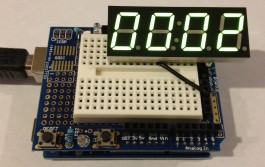
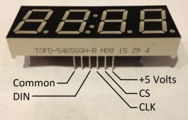
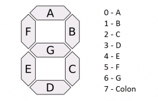

# PT6961

To be clear : I did not write this library, but as it's published into the public domain and the author's website is now down I thought it would be a good idea to upload this back on GitHub. All credits go to   Garrett Blanton. Here is what they wrote on their original blog post :

## Introduction



The TOFD-5465GGH-B is a 4 digit 7 segment display with a PT6961 LED driver embedded on the back.
I found these on Ebay for 10 for $10 plus shipping.
Ended up being about $1.30 each.
The PT6961 is an LED driver with a SPI interface which means you can talk to it with any microcontroller (PIC, STAMP, Arduino, etc.)
I used both a PIC 18F458 & Arduino Uno to communicate with it.
Very little information was available on these displays and I owe a thanks to some members of the http://forum.43oh.com forum for pointing me in the right direction.
Below are the details regarding the implementation with an Arduino Uno controller.

## Pinout

The pinout for the display is shown below.
Pin 1 is the pin closes to pin 1 on the PT6961.
This is the left most pin when the display is face down with the pins down.

1. Power (+5 Volts)
2. Chip Select (Active Low)
3. Clock
4. DIN
5. DOUT
6. Common



The chip select is active low meaning that it must be pulled low to enable the chip for communications.
The clock signal is used to load data into the display and the PT6961 reads data on the rising edge of the clock pulse.
The data in pin shift data into the display LSB first.
Please refer to the data sheet on the PT6961 for more information.

## Segment Mapping

The PT6961 controller uses display RAM to store the data that is transferred from the external device (Arduino).
This dispay RAM is mapped to the LED segments.
The LED display uses the RAM at addresses 0xC0 (segment 1), 0xC2 (segment 2), 0xC4 (segment 3), and 0xC6 (segment 4).
Each bit at the address represents a segment on the display.
The segment map is shown below.
The decimal points do not appear to be connected to the LED display.
The colon segments are controlled from the 7th bit of 0xC0 and 0xC2.



## Program

Below is a sample program using the Arduino Uno.
I wrote a PT6961 driver for the Arduino which is available for download below.

```cpp
#include "PT6961.h"
// Pin 2 = CS
// Pin 3 = CLK
// Pin 4 = DIN
PT6961 LED(4, 3, 2);
void setup()
{
     LED.initDisplay();
     Serial.begin(9600);
}

void loop()
{
     //count through 0-9,a-f
     for(int i=0; i<16; i++)
     {
          LED.sendDigits(0,0,0,i,0);
          Serial.println(i);
          delay(500);
     }
}
```

## PT6961 Library

This library has not been well tested, so please post any problems or comments here.

`PT6961(int DIN, int CLK, int CS);`

PT6961 is the constructor for the library.
This is called at the first of the program and the pins used for communications are assigned.

`void initDisplay();`

This function is called in the setup routine of the Arduino program to initialize the display driver.

`void initRAM();`

This function is used to clear the display RAM in the PT6961.

`void sendCmd(char cmd);`

This function is used to send commands to the PT6961.
A listing of the commands enumeration is shown below

* `_AUTO_INCREMENT` – Auto increment display RAM
* `_FIXED_ADDRESS` – Fixed display RAM address
* `_DISPLAY_OFF` – Turn display off
* `_DISPLAY_1_16` – Turn display on 1/16 cycle
* `_DISPLAY_2_16` – Turn display on 2/16 cycle
* `_DISPLAY_4_16` – Turn display on 4/16 cycle
* `_DISPLAY_10_16` – Turn display on 10/16 cycle
* `_DISPLAY_11_16` – Turn display on 11/16 cycle
* `_DISPLAY_12_16` – Turn display on 12/16 cycle
* `_DISPLAY_13_16` – Turn display on 13/16 cycle
* `_DISPLAY_14_16` – Turn display on 14/16 cycle

`void sendNum(int num, char colon);`

 This function is used to send a number and enable the colon.
 Parameters are num (0-F) & colon (0=off; 1=on)

`void sendDigits(char digit1, char digit2, char digit3, char digit4, char colon);`

This function is used to send a number as individual digits.
Parameters are `digit1` (`0`-`F`), `digit2` (`0`-`F`), `digit3` (`0`-`F`), `digit4` (`0`-`F`), & `colon` (`0`=off; `1`=on)

## Downloads

### PT6961 Arduino driver

[PT6961 Driver](https://github.com/Renaud11232/PT6961/archive/master.zip)

### PT6961 Data Sheet

[PT6961 Datasheet](https://raw.githubusercontent.com/Renaud11232/PT6961/master/assets/docs/PT6961.pdf)
